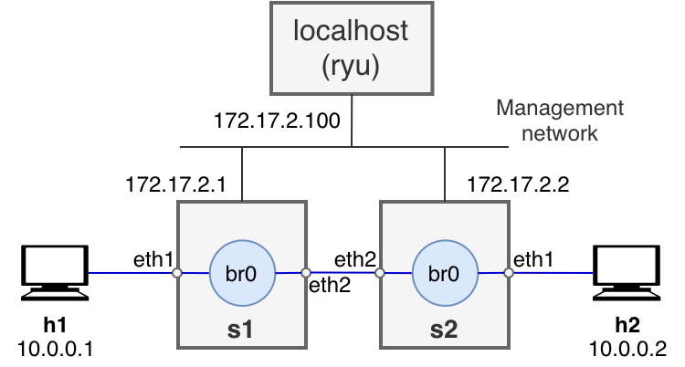

# vnx-qos-ryu
Simple VNX scenario using the Ryu controller to test QoS funcions that can be set with REST. It defines two hosts, two containers acting as OpenFlow switches and a management network linking the switches and the localhost.
It is based on the per-flow QoS example in the [QoS section](https://osrg.github.io/ryu-book/en/html/rest_qos.html) of Ryubook 1.0 documentation.

## Diagram 


## Requirements
Ubuntu with VNX and Ryu. It can be tested using the following ova:
- [VNXSDNLAB2020-v2.ova](https://idefix.dit.upm.es/download/vnx/vnx-vm/VNXSDNLAB2020-v2.ova)

## Quick guide 

1. (Optional, the modified qos_simple_switch_13.py is already included) To work with the Qos module, modify simple_switch_13.py to register flow entries into table id:1, as follows:

```shell
sed '/OFPFlowMod(/,/)/s/)/, table_id=1)/' /usr/lib/python3/dist-packages/ryu/app/simple_switch_13.py > qos_simple_switch_13.py
```

2. Start ryu in a terminal:

```shell
ryu-manager ryu.app.rest_qos ryu.app.rest_conf_switch ./qos_simple_switch_13.py
```

3. Start the scenario in a different terminal:

```shell
sudo vnx -f qos-ryu.xml -v -t
```

(You can use option -P once you are finised to stop the scenario):

```shell
sudo vnx -f qos-ryu.xml -v -P
```

4. Use the REST API to set ovsdb_addr in order to access OVSDB in switch s2, using curl from the terminal:

```shell
curl -X PUT -d '"tcp:172.17.2.2:6632"' http://172.17.2.100:8080/v1.0/conf/switches/0000000000000002/ovsdb_addr
```

5. Define a **htb** queing discipline to limit the rate in s2 interface to s1 to a global max_rate of **1 Mbps** and set the following queues:

|Queue ID|Max rate  |Min rate  |
|--------|----------|----------|
|0       |500 Kbps  |-         |
|1       |-         |800 Kbps  |

Use the REST API for this **queue settings**:

```shell
curl -X POST -d '{"port_name": "eth2", "type": "linux-htb", "max_rate": "1000000", "queues": [{"max_rate": "500000"}, {"min_rate": "800000"}]}' http://172.17.2.100:8080/qos/queue/0000000000000002
```

6. The default queue is qid=0. Define the following flow entry in the switch to direct that flow to qid:1.

|(Priority)|Destination address|Destination port|Protocol|Queue ID|(QoS ID)|
|----------|-------------------|----------------|--------|--------|--------|
|1         |10.0.0.1           |5002            |UDP     |1       |1       |

```shell
curl -X POST -d '{"match": {"nw_dst": "10.0.0.1", "nw_proto": "UDP", "udp_dst": "5002"}, "actions":{"queue": "1"}}' http://172.17.2.100:8080/qos/rules/0000000000000002
```

7. Verify the setting 

```shell
curl -X GET http://172.17.2.100:8080/qos/rules/0000000000000002
```

8. Verify it works
The following test should result in bandwidth under 500 Kbps

```shell
h1> iperf -s -u -i 1 -p 5001
h2> iperf -c 10.0.0.1 -p 5001 -u -b 1M -l 1200 
```

The following test should result in bandwidth over 800 Kbps, but below 1 Mbps

```shell
h1> iperf -s -u -i 1 -p 5002
h2> iperf -c 10.0.0.1 -p 5002 -u -b 1M -l 1200
```

9. Commands to check ovs qos and queues

This command in s2 should show two queues are being used:

```shell
s2> ovs-ofctl -O OpenFlow13 queue-stats br0
```

This command obtains queue ids:

```shell
s2> ovs-vsctl list qos
```

This command shows the configuration of a queue:

```shell
s2> ovs-vsctl list queue <queue_id>
```


